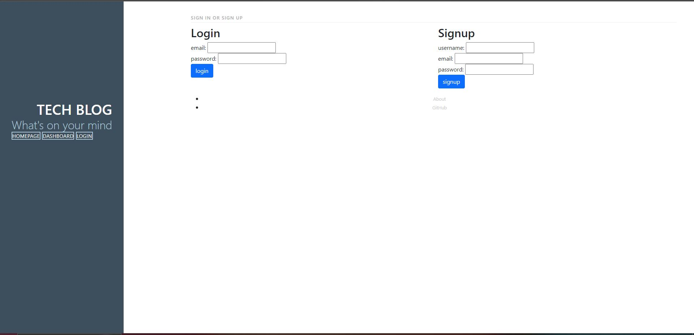

# Tech Blog - CMS-style Blog Application

## Description

The Tech Blog is a CMS-style blog site, similar to Wordpress, where developers can create and publish blog posts and interact by commenting on other developers’ posts. This application follows the Model-View-Controller (MVC) paradigm, making use of modern technologies such as Sequelize ORM, Handlebars.js for templating, and express-session for authentication.

The site is a platform for developers to share thoughts on technical concepts, advancements, and new technologies. Users can sign up, log in, create blog posts, edit or delete their own posts, and comment on others' posts.

Features
- User authentication (sign up, login, and logout).
- Create, edit, and delete blog posts.
- Modern UI: Clean, simple, and responsive design for a better user experience.
- Follows the MVC design pattern for clear separation of concerns.

([Link to deployed website](https://tech-blog-r7sw.onrender.com))

([Code source location](https://github.com/Ashleighjg/tech-blog))

Tech Stack
- Node.js: JavaScript runtime environment.
- Express.js: Web framework for Node.js, used for routing.
- JavaScript (ES6+)
- Sequelize ORM: SQL-based ORM to interact with the MySQL database.
- MySQL2: MySQL client for Node.js
- Handlebars.js: Templating engine to dynamically generate HTML pages.

## Table of Contents

- [Installation](#installation)
- [Usage](#usage)
- [License](#license)
- [Contributing](#contributing)
- [Tests](#tests)
- [Questions](#questions)

## Installation

N/A

## Usage

- Sign up and log in.
- View all blog posts on the home page.
- Create new posts from their dashboard.
- Edit or delete their own posts.
- Comment on other users' posts.

## License

This project is licensed under the ([MIT](https://opensource.org/licenses/MIT)) license.

## Contributing

Portions of this code is sourced from Xpert Learning Assistant.

([Xpert Learning Assistant](https://bootcampspot.instructure.com/courses/6022/external_tools/313))

## Tests

N/A

## Questions

If you have any questions you can email me at Ashleighjg@gmail.com or contact me via Github [Ashleighjg](https://github.com)